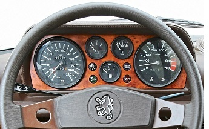
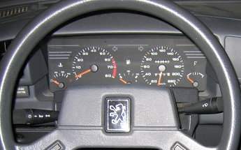
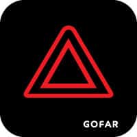
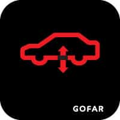
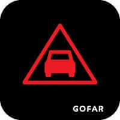
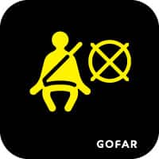

# P2AfamefunaUmejiaku
**CS 5331 - Human Computer Interaction** 
**April 2021 
Umejiaku Promise Afamefuna 
The car dashboard (Peugeot)  **

A car's dashboard is a control panel usually position directly ahead of a driver displaying instrumentations and controls of vehicle operations. Here would be analyzing the dashboards of Peugeot brand of cars to answer the following questions -  

1. Using Photos show 5 examples of car dashboards.
2. State the pros vs. cons with the current designs and explain why it is good vs. bad.
3. List your most common features and other more rare uses of a car dashboards.
4. List the controls that the user interacts with the car dashboards.
5. What are some common mistakes you can make with this current designs?
6. Suggest the improvements to make on the control interface. Sketch your solution and justify your design decisions.
7. Come up with your design for the dashboard?
8. Design and implement interactive features
9. Design and implement user feedback using Processing/Processing.js.

 

## Peugeot 504 
Debuted and marketed as Peugeot's flagship at the 1968 Paris Salon, the 504 received the 1969 European Car of the Year being praised for its styling, quality, chassis, ride, visibility, strong engine and refinement with over 3 million vehicles manufactured in its European production and about half a million in Africa. 
 
**
 **Pros of Peugeot 504 dashboard** 
**
1. Most if not all the features in the dashboard are easy to understand.
2. The Used only KM/H in the speedometer hence its easy to know the measurement metric. 
**
 Cons of Peugeot 504 dashboard 
**
1) Several important features a dashboard should have are not included. 

## Peugeot 405 
Debuted and marketed as Peugeot's flagship at the 1968 Paris Salon, the 504 received the 1969 European Car of the Year being praised for its styling, quality, chassis, ride, visibility, strong engine and refinement with over 3 million vehicles manufactured in its European production and about half a million in Africa. 

**
 **Pros of Peugeot 405 dashboard** 
**
1. Most if not all the features in the dashboard are easy to understand.
2. The Used only KM/H in the speedometer hence its easy to know the measurement metric. 
**
 Cons of Peugeot 405 dashboard 
**
1) Several important features a dashboard should have are not included. 

## Peugeot 505 
Debuted and marketed as Peugeot's flagship at the 1968 Paris Salon, the 504 received the 1969 European Car of the Year being praised for its styling, quality, chassis, ride, visibility, strong engine and refinement with over 3 million vehicles manufactured in its European production and about half a million in Africa. 

**
 **Pros of Peugeot 505 dashboard** 
**
1. Most if not all the features in the dashboard are easy to understand.
2. The Used only KM/H in the speedometer hence its easy to know the measurement metric. 
**
 Cons of Peugeot 505 dashboard 
**
1) Several important features a dashboard should have are not included. 

## Peugeot 308 
Debuted and marketed as Peugeot's flagship at the 1968 Paris Salon, the 504 received the 1969 European Car of the Year being praised for its styling, quality, chassis, ride, visibility, strong engine and refinement with over 3 million vehicles manufactured in its European production and about half a million in Africa. 

**
 **Pros of Peugeot 308 dashboard** 
**
1. Most if not all the features in the dashboard are easy to understand.
2. The Used only KM/H in the speedometer hence its easy to know the measurement metric. 
**
 Cons of Peugeot 308 dashboard 
**
1) Several important features a dashboard should have are not included. 

## Peugeot 208 
Debuted and marketed as Peugeot's flagship at the 1968 Paris Salon, the 504 received the 1969 European Car of the Year being praised for its styling, quality, chassis, ride, visibility, strong engine and refinement with over 3 million vehicles manufactured in its European production and about half a million in Africa. 

**
 **Pros of Peugeot 208 dashboard** 
**
1. Most if not all the features in the dashboard are easy to understand.
2. The Used only KM/H in the speedometer hence its easy to know the measurement metric. 
**
 Cons of Peugeot 208 dashboard 
**
1) Several important features a dashboard should have are not includeffd. 

### Common mistakes you can make with the 505 design
1.	Several icons are clustered cons are clustered at the top making it difficult to quickly identify an icon.
2.	The fuel and temperature are position in a manner that with a quick glance for someone not familiar would confuse.
3.	The car speed might be diffculty to see with a quick glance
4.	Seeing red icons could cause a driver to stop driving not knowing that its not really a critical indication.
5.	The Fuel indicator and the Engine temperature are going in reverse directions likely to be confusing.

### Proposed improvements to the dashboard.
1.	Remove the cluttering of icons on the top by appropriately positioning the icons.
2.	Ensure the color of icons have closely related meanings to make it easier to draw inference.
3.	Make sure that similar icons are grouped together.
4.	Ensure every meter goes in the same direction.
5.	Provide additional meaning for any icon turned on.
6.	Ensure the Speed is clearly displayed.

### Common Dashboard Features
| Models | Description |
| --- | --- |
|  | BRAKE WARNING |
|  | SIGNAL LIGHT|
|  | FUEL LEVEL INDICATOR |
|  | WINDSCREEN DEFROSTER |
|  | FOG LIGHT|
|  |HIGH BEAM LIGHT |
|  |LOW BEAM LIGHT |
|  | SEAT BELT WARNING |
|  | CHECK ENGINE LIGHT |
|  | OVER DRIVE INDICATOR|
|  | CRUISE CONTROL|
|  | ENGINE TEMPERATURE WARNING |
|  | OIL INDICATOR |
|  | HAZARD LIGHT |
|  | RECIRCULATED CABIN AIR|

### Rare Dashboard Features

| Models | Description |
| --- | --- |
|  | AIR SUSPENSION |
|  |GEAR WARNING|
|  | BRAKE PAD INDICATOR |
|  | GAS /FUEL CAP |
|  | DISTANCE WARNING|
|  |ICY ROAD WARNING LIGHT |
|  |INFORMATION WARNING LIGHT |
|  | SEAT BELT WARNING |
|  | ESP FAULT/TRACTION CONTROL  MALFUNCTION|
|  | REDUCED POWER WARNING|
|  | SIDE AIR|
|  | TRAILER TOW HITCH WARNING |
|  | CLUCTH PEDAL|

### Controls user interact with car dashboards

| CONTROLS| Description |
| --- | --- |
| BRAKE | This affects the Speedometer, Usually below the drivers feet, used to slowdown or bring a car to a halt.    |
| THROTTLE |This affects the Speedometer, Usually below the drivers feet, used to speedup a car.|
| CRUISE BUTTON | This displays the cruise control icon, used to maintain a cars speed. |
| LIGHT | This displays the appropiate light icon, turning on the car's light.|
| SIGNALS |This displays the appropiate signal icon, turning on the car's light.|
| WIPER|This displays the wiper icon, alerting driver wiper is on. |
| AIR CONDITIONER |This displays the various icons related to control the temperature and air inside the car. |
|SEAT BELT|The seat belt icon, turns off ones the set belt is worn. |

A  picture with a link to the video is shown below. 
[ Click the image below to watch a short video demo.](https://www.youtube.com/watch?v=2r75rA8yok8&ab_channel=AfamefunapromiseUmejiaku)  
 

